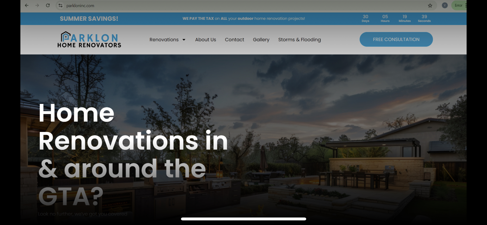
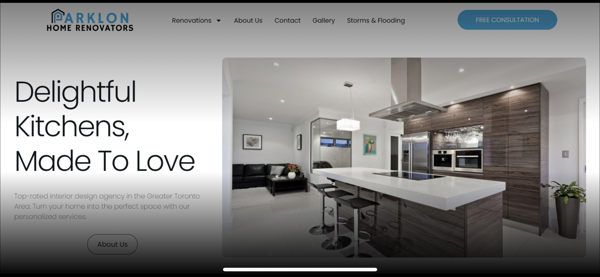
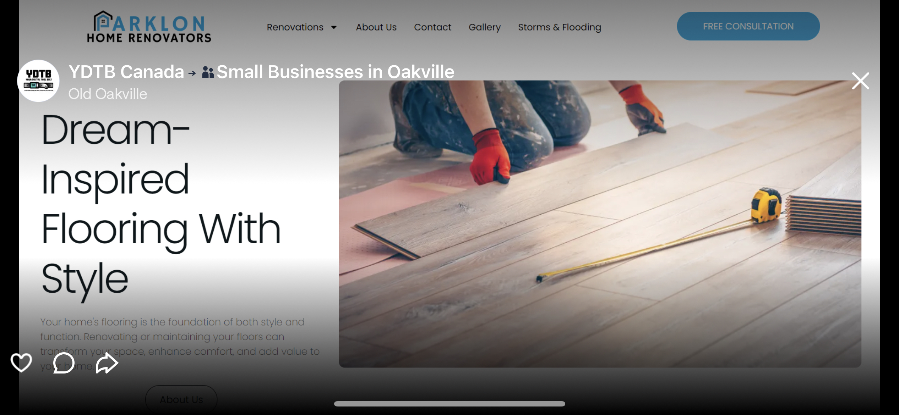

# 🌐 Michael Pereira – Web Design Portfolio

A curated selection of WordPress projects I’ve delivered, focused on **branding, responsive design, and client goals**.  
All projects were built with **WordPress + Elementor**, supported by **Adobe Creative Suite / Canva** for design, and optimized for **SEO & user experience**.

---

## 🔹 [Dentrick.com](https://dentrick.com)

**Role:** Lead Designer & Developer  
**Highlights:**
- Designed and built full WordPress site in Elementor  
- Established a modern brand style with consistent typography & color system  
- Delivered fully responsive layouts for desktop, tablet, and mobile  
- Optimized site structure and load speed for performance  

**Tools:** WordPress, Elementor, Adobe Express  

---
## 🔹 [Greysuits.ca](https://greysuits.ca)

**Role:** Web Designer  
**Highlights:**
- Designed professional B2B site aligned with corporate branding  
- Styled service pages and blog layouts for clear navigation  
- Implemented responsive design best practices  

**Tools:** WordPress, Elementor, Adobe Illustrator  

---
## 🔹 [HumanEquity.ca](https://humanequity.ca) ** In Development

**Role:** Designer & Developer  
**Highlights:**
- Rebuilt corporate site for Human Equity Advantage using WordPress + Elementor  
- Migrated and reformatted 7+ thought leadership articles and integrated podcasts  
- Designed the Equity Continuum visual framework to align with brand identity  
- Implemented rolling implementation strategy for publishing content  
- Ensured responsive layouts and accessibility compliance across devices  

**Tools:** WordPress, Elementor, Adobe Illustrator, Canva, Custom CSS  

## 🔹 [Terrasecura.ca](https://terrasecura.ca)

**Role:** Designer & Developer  
**Highlights:**
- Created cybersecurity-focused branding and visual design  
- Built site architecture with Elementor for scalability  
- Integrated secure lead forms and call-to-action funnels  
- Applied SEO fundamentals for keyword targeting  

**Tools:** WordPress, Elementor, Custom CSS, Adobe Photoshop  

## 🔹 [GreenwayAccounting.ca](https://greenwayaccounting.ca)

**Role:** Designer & Developer  
**Highlights:**
- Built accounting firm site emphasizing professionalism and trust  
- Designed landing pages tailored for client acquisition  
- Applied local SEO optimization for accounting services  

**Tools:** WordPress, Elementor, Canva  

---

## 🔹 [YourDigitalToolBelt.ca](https://yourdigitaltoolbelt.ca)

**Role:** Co-Founder, Designer & Developer  
**Highlights:**
- Built full company site to promote web design & digital services  
- Developed service funnels and call-to-action landing pages  
- Established brand identity (logo, typography, colors) across web & social  
- Integrated blog + client engagement features  

**Tools:** WordPress, Elementor, Adobe Express, Canva  

---

## 🔹 Parklon Inc. (Case Study)

**Role:** Designer, Content Creator, Digital Strategist  
**Highlights:**
- Designed modern renovation-focused website in WordPress + Elementor  
- Created custom layouts for services (Flooring, Kitchens, Basements, Backyards)  
- Developed content strategy with CTAs (free same-day consultations)  
- Captured & edited visuals to align with brand storytelling

**Tools Used:**  
- CMS: WordPress + Elementor  
- Design: Adobe Express, Canva  
- Front-end: Custom CSS tweaks for layout  
- Content: Original photography + video editing 

### 📸 Screenshots

## 🛠 Skills & Tools Demonstrated
- CMS: WordPress (Elementor), basic Shopify familiarity  
- Design: Adobe Creative Suite (Photoshop, Illustrator, InDesign), Canva  
- UI/UX: Wireframes, responsive layouts, user-centered design  
- Front-end: HTML & CSS, basic JavaScript knowledge  
- Project Management: Asana, Trello, Google Workspace  
- SEO & Accessibility: On-page optimization, performance improvements  

---

👉 **Like what you see?** Let’s connect:  
📧 mppereira1@outlook.com | 💼 [LinkedIn](https://www.linkedin.com/in/michael-pereira-8619601b6/)
